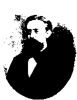
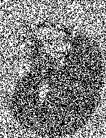
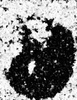
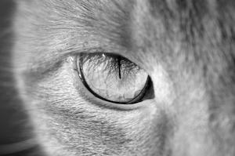
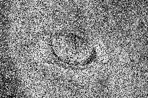
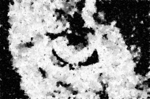

# dnoise
Image De-Noising using Monte Carlo Inference

| Original Image | Noisy Image | De-Noised Image |
| -------------- |:-----------:| --------------- |
||||

| Original Image | Noisy Image | De-Noised Image |
| -------------- |:-----------:| --------------- |
||||

**Image credits**: 
1. Image of Markov - CMPSCI 688(Spring '17) at UMass Amherst
2. Image of Cat - CMPSCI 670(Fall '17) at UMass Amherst
